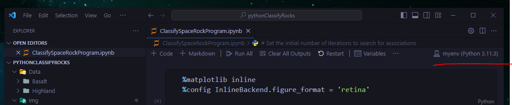

# pythonClassifyRocks
<!-- Improved compatibility of back to top link: See: https://github.com/othneildrew/Best-README-Template/pull/73 -->
<a name="readme-top"></a>
<!--
*** Thanks for checking out the Best-README-Template. If you have a suggestion
*** that would make this better, please fork the repo and create a pull request
*** or simply open an issue with the tag "enhancement".
*** Don't forget to give the project a star!
*** Thanks again! Now go create something AMAZING! :D
-->


<!-- PROJECT SHIELDS -->
<!--
*** I'm using markdown "reference style" links for readability.
*** Reference links are enclosed in brackets [ ] instead of parentheses ( ).
*** See the bottom of this document for the declaration of the reference variables
*** for contributors-url, forks-url, etc. This is an optional, concise syntax you may use.
*** https://www.markdownguide.org/basic-syntax/#reference-style-links
-->
<!--
[![Contributors][contributors-shield]][contributors-url]
[![Forks][forks-shield]][forks-url]
[![Stargazers][stars-shield]][stars-url]
[![Issues][issues-shield]][issues-url]
[![MIT License][license-shield]][license-url]
[![LinkedIn][linkedin-shield]][linkedin-url]
-->


<!-- PROJECT LOGO -->
<br />
<div align="center">
  <a href="https://github.com/hspdaw/pythonClassifyRocks">
    
  </a>

  <h3 align="center">Learn about space rocks and how to classify them</h3>

  <p align="center">
    Nice introduction to Python
    <br />
    <a href="https://learn.microsoft.com/en-us/training/modules/introduction-python-nasa/"><strong>Explore the docs »</strong></a>
</div>


<!-- TABLE OF CONTENTS -->
<details>
  <summary>Table of Contents</summary>
  <ol>
    <li>
      <a href="#about-the-project">About The Project</a>
      <ul>
        <li><a href="#built-with">Built With</a></li>
      </ul>
    </li>
    <li>
      <a href="#getting-started">Getting Started</a>
      <ul>
        <li><a href="#installation">Installation</a></li>
      </ul>
    </li>
    <li><a href="#usage">Usage</a></li>
    <li><a href="#roadmap">Roadmap</a></li>
    <li><a href="#license">License</a></li>
    <li><a href="#contact">Contact</a></li>
    <li><a href="#acknowledgments">Acknowledgments</a></li>
  </ol>
</details>


<!-- ABOUT THE PROJECT -->
## About The Project

Just a practice with python.

<p align="right">(<a href="#readme-top">back to top</a>)</p>


### Built with common Python libraries for AI projects

The libraries are free and are commonly used in real-life AI projects.

* <a href="https://www.anaconda.com">Anaconda environment</a>
* <a href="https://matplotlib.org/">Matplotlib</a>
* <a href="https://numpy.org/">NumPy</a>
* <a href="https://pytorch.org/">PyTorch</a>


<p align="right">(<a href="#readme-top">back to top</a>)</p>


<!-- GETTING STARTED -->
## Getting Started

Go to the <a href="https://www.anaconda.com/download">Anaconda download page</a> to install Anaconda.
After installation completes, the application is available on your computer:
If you're using Windows, run the Anaconda prompt from the Start menu.


### Installation

_Follow these steps to create the environment:._

1. At the Anaconda prompt, run the conda create command to start the Anaconda environment:
   ```sh
   conda create -n myenv python=3.11 pandas jupyter seaborn scikit-learn keras pytorch pillow
   ```
2. When you're prompted to install the packages, enter Y, and then press Enter.
3. To activate your new environment, run the conda activate command:
   ```sh
   conda activate myenv
   ```
4. The new environment is ready to use, but we need to add one more library through a separate install command.
5. At the Anaconda prompt, run the conda install command:
   ```sh
   conda install -c pytorch torchvision
   ```
<p align="right">(<a href="#readme-top">back to top</a>)</p>


<!-- USAGE EXAMPLES -->
## Usage

Create project folder and Jupyter Notebook file with Visual Studio Code and save it.
The saved Jupyter Notebook file should have the file extension .ipynb

* At the upper-right and lower-left corners of Visual Studio, change the environment to the new Anaconda environment you created.
<div align="center">
    
</div>


<!-- ROADMAP -->
## Roadmap

- [x] <a href="https://learn.microsoft.com/en-us/training/modules/analyze-rock-images-ai-nasa/">Analyze images of rocks by using artificial intelligence</a>
- [x] <a href="https://learn.microsoft.com/en-us/training/modules/train-test-predictive-ai-model-nasa/">Classify types of space rocks in random photos by using artificial  intelligence</a>
- [x] <a href="https://learn.microsoft.com/en-us/training/modules/train-test-predictive-ai-model-nasa/">Classify space rocks by using Python and artificial intelligence</a>


<p align="right">(<a href="#readme-top">back to top</a>)</p>


<!-- LICENSE -->
## License

Distributed under the MIT License. See `LICENSE.txt` for more information.

<p align="right">(<a href="#readme-top">back to top</a>)</p>


<!-- CONTACT -->
## Contact

Your Name - hspdaw

Project Link: [https://github.com/hspdaw/pythonClassifyRocks](https://github.com/hspdaw/pythonClassifyRocks)

<p align="right">(<a href="#readme-top">back to top</a>)</p>


<!-- ACKNOWLEDGMENTS -->
## Acknowledgments

Thanks to Ifeoluwa Oyelakin, for saving the dataset in Kaggle

*  <a href="https://www.kaggle.com/datasets/ifeoyelakin/nasa-space-rocks">Dataset NASA Space Rocks</a>  


<p align="right">(<a href="#readme-top">back to top</a>)</p>


